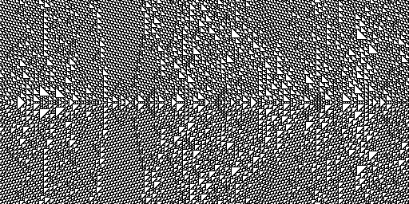
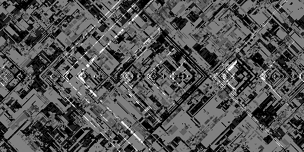
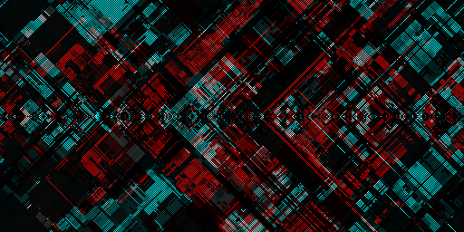

# 1dca
manhattan rain and variants  
Programs creating generative art based on one-dimensional cellular automata (chiefly rule 184)
## binaries
* `1dca` seeds a horizontal line and evolves generations upwards and downwards based on a custom rule - outputs pbm data to stdout
* `1dca2` similarly evolves multiple layers of rule 184 in a "noisy environment" - writes a pgm file
* `1dca3` same as `1dca2`, but in color - writes a ppm file
* `1dca4` same as `1dca3`, but generating multiple files, gradually moving the layers before combining them, the colormap is also different - writes multiple ppm files
* `1dca5` similar to `1dca4`, but instead of generating files everything is rendered on the screen with sdl and opengl

## examples
* `1dca` rule 110:  

* `1dca2`:  

* `1dca3`:  

* combination of `1dca4` output frames:  
https://youtu.be/zfStbsro6TE
